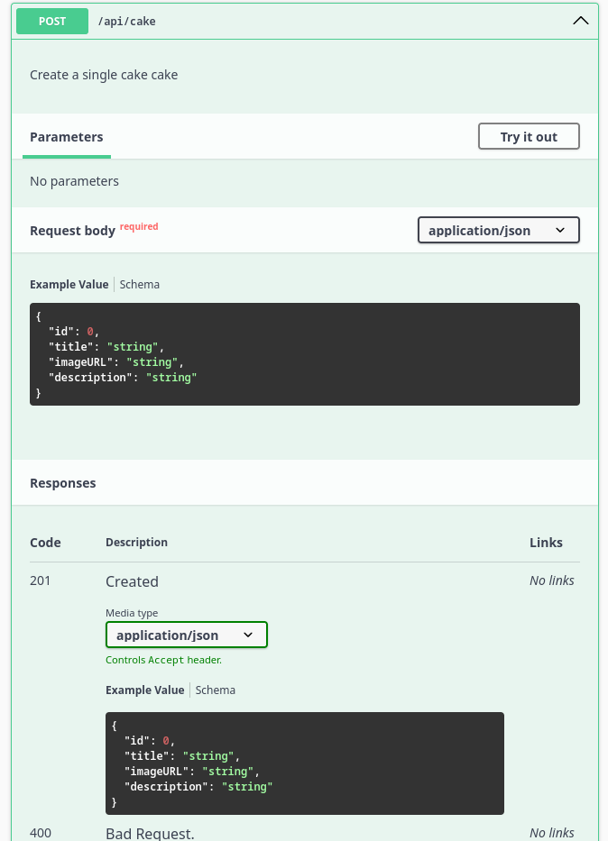

# cake-manager
Fork off [Waracle cake manager](https://github.com/Waracle/cake-manager) coding test

Cake Manager Micro Service (fictitious)
=======================================

Requirements:
* By accessing api/cakes, it should be possible to list the cakes currently in the system. JSON would be an acceptable response format.
* It must be possible to add a new cake.
* It must be possible to update an existing cake.
* It must be possible to delete an existing cake.

Bonus points:
* Add some suitable tests (unit/integration...) 
* Add some Authentication / Authorisation to the API
* Continuous Integration via any cloud CI system
* Containerisation

# How to run
## Prerequisites to run locally localhost
The followings should be installed on your machine:
* Have Java 21 JDK or higher.
* docker
* minikube & cubectl installed and running

## Gradle build
From your project root directory, run:
<code> gradle clean assemble</code>

**Note:** This is important when building the docker image. Docker needs to extract
the built jar from the libs folder.

## Gradle Spring Boot Run
From your project root directory, run:
<code> gradle clean bootRun --args='--spring.profiles.active=dev' </code>

This will start Spring boot on Spring boot, running on port 8080 (http://localhost:8080/)

## Starting up the applications using docker-compose
Back on root directory, cake-manager, run the following command:

<code> $ docker-compose up --build</code>

This will start two docker instances:
* PostgreSQL DB, running on port 5432 (jdbc:postgresql://localhost:5432/cake_mngr_db)
* Spring boot, running on port 8080 (http://localhost:8080/)

### Tear down your docker-compose instances
Run: <code> $ docker-compose down</code>

# Kubernetes set-up
## Prerequisites for running locally
* Have minikube & cubectl installed and running on your local machine.
* Build docker image cake-manager-service-docker-image: On your project's root directory, run <code> docker build -t cake-manager-service-docker-image:1.0.0</code>
* Upload docker image to minikube: <code>minikube image load cake-manager-service-docker-image:1.0.0</code>
## Run Kubernetes cluster 
Run:
<code>kubectl apply -f cake-manager-k8s-minikube.yaml</code>
### Find out host IP address where minikube deployed the app (to test locally)
Run:
<code>$ minikube ip</code>
Will return something like: <code>192.168.49.2</code>

You can then tests the API by sending requests to <code>http://192.168.49.2:30080</code>. Port 30080 is the port opened for outside API requests and calls. 

## Tear down the kubernetes cluster
Run: 
<code>kubectl delete -f cake-manager-k8s-minikube.yaml</code>

# Open-API Documentations
Swagger's API Documentation can be found on http://localhost:8080/swagger-ui/index.html, if run locally, or through docker-compose.
## List of public APIs and Schemas

## Single API for creating a new entity

